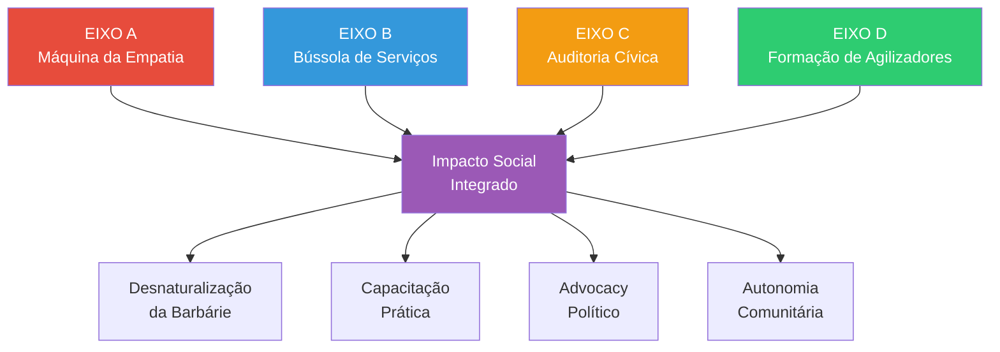

# Os 4 Eixos do Canal Pop Rua 2026

> **Missão:** Transformar o audiovisual em ferramenta de **agilização social**, não apenas entretenimento.

---

## Estrutura Conceitual

O canal opera em **quatro frentes coordenadas** que se complementam para criar um ecossistema completo de transformação social:



---

## EIXO A: Máquina da Empatia (Sensibilização)

### Objetivo
Usar o audiovisual como **"espelho"** para a sociedade e **"microscópio"** para o invisível.

### Função Social
Desnaturalizar a barbárie do cotidiano através de narrativas públicas que conectam:
- **Story of Self:** Trajetória individual digna
- **Story of Us:** Falha coletiva sistêmica
- **Story of Now:** Urgência de ação

### Exemplo de Aplicação
**Vídeo:** "O Endereço Invisível" (Terminal de Ônibus)
- **Gancho:** "Você está no terminal agora. Olhe ao redor..."
- **Espelho:** Identificação com a rotina de espera, cansaço, busca por emprego
- **Microscópio:** Revela a armadilha burocrática (sem endereço = sem emprego)
- **Resultado Esperado:** Espectador questiona o "desvio de olhar" naturalizado

### Métricas de Sucesso
- Taxa de compartilhamento > 5%
- Comentários demonstrando empatia (não pena)
- Cliques em recursos de serviço no final

---

## EIXO B: Bússola de Serviços (Capacitação)

### Objetivo
Criar vídeos **utilitários** (estilo *how-to*) que explicam fluxos de sobrevivência.

### Função Social
Traduzir a burocracia em passos acionáveis, removendo barreiras informacionais.

### Temas Prioritários (Campinas)

| Serviço | Tema do Vídeo | Duração |
|---------|---------------|---------|
| **Centro POP** | "Como conseguir endereço de referência" | 60s |
| **Bagageiro Municipal** | "Onde guardar seus pertences com segurança" | 45s |
| **Consultório na Rua** | "Atendimento médico sem agendamento" | 60s |
| **Conta Simplificada CEF** | "Abrir conta bancária sem comprovante de residência" | 90s |
| **Carteira de Trabalho Digital** | "Baixar CTPS pelo celular sem ir ao posto" | 75s |
| **Cadastro Único (CadÚnico)** | "Acesso a benefícios sociais - passo a passo" | 120s |

### Formato Obrigatório
1. **Intro (5s):** "Se você está na rua em Campinas, isso é para você"
2. **Contexto (10s):** Por que esse serviço é crítico
3. **Passo a Passo (40-60s):** Instruções visuais claras
4. **Fechamento (10s):** Endereço, horário, telefone na tela

### Checklist de Validação
- ✅ Informações atualizadas (verificadas nos últimos 30 dias)
- ✅ Endereços completos com ponto de referência
- ✅ Horários de funcionamento específicos
- ✅ Alternativas caso o serviço esteja fechado
- ✅ Linguagem acessível (Flesch > 70)

---

## EIXO C: Auditoria Cívica (Advocacy)

### Objetivo
Denunciar **arquitetura hostil** e mobilizar a comunidade para pressionar autoridades.

### Base Legal
- **Lei Federal 14.489/2022:** Proíbe arquitetura hostil em espaços públicos
- **Constituição Federal, Art. 5º:** Dignidade humana
- **Decreto 7.053/2009:** Política Nacional para População em Situação de Rua

### Temas para Investigação

#### 1. Arquitetura Hostil em Campinas
**Exemplos documentáveis:**
- Bancos públicos com divisórias metálicas
- Aspersores de água em marquises
- Pedras sob viadutos
- Gradis em praças
- Remoção de lixeiras

**Formato de Vídeo:**
```
[0-10s]  Mostrar o local hostil sem narração (impacto visual)
[10-30s] Explicar a função original do espaço público
[30-50s] Citar a Lei 14.489/22 e consequências legais
[50-60s] CTA: "Documente e envie ao MP via [link]"
```

#### 2. Déficit de Vagas em Abrigos
**Dados Campinas (Censo PopRua 2024):**
- 72% das pessoas em situação de rua não têm onde dormir
- Capacidade dos abrigos vs. demanda real
- Filas de espera para vagas

**Abordagem Narrativa:**
- Humanizar os números (1 vaga = 1 pessoa = 1 história)
- Comparar investimento público em outras áreas
- Mostrar soluções implementadas em outras cidades

#### 3. Casos de Sucesso em Advocacy
**Inspiração:** Estudantes que conseguiram construção de estrada

**Estrutura:**
```
Story of Self:    Comunidade X enfrentava problema Y
Story of Us:      Isso reflete falha sistêmica Z
Story of Now:     Eles se organizaram assim [passo a passo]
Resultado:        Conquista concreta + como replicar
```

### Call to Action Wikimedista

**Todo vídeo de advocacy DEVE terminar com:**

> "📸 Viu arquitetura hostil em Campinas?  
> 1. Tire foto com localização GPS  
> 2. Suba no Wikimedia Commons: [link curto]  
> 3. Marque @MinisterioPublicoSP  
> **Cada foto é uma evidência. Vamos construir o acervo probatório juntos.**"

### Indicadores de Impacto
- Número de uploads no Wikimedia Commons
- Menções ao MP em redes sociais
- Processos administrativos abertos
- Mudanças concretas na política pública

---

## EIXO D: Formação de Agilizadores (Profissionalização)

### Objetivo
Ensinar a **stack tecnológica** para que a própria comunidade se torne criadora de elite.

### Público-Alvo
1. Pessoas em situação de rua com acesso a dispositivos
2. Voluntários de ONGs
3. Estudantes de serviço social
4. Ativistas de direitos humanos

### Currículo Modular

#### Módulo 1: Storytelling com IA (Iniciante)
**Conteúdo:**
- Como usar ChatGPT para escrever roteiros
- Master Prompt Pop Rua 2026 explicado
- Validação ética básica

**Entregável:** 1 roteiro aprovado de 60 segundos

---

#### Módulo 2: Produção Faceless (Intermediário)
**Conteúdo:**
- Narração com ElevenLabs
- Geração visual com Midjourney (prompts otimizados)
- Montagem básica no CapCut

**Entregável:** 1 vídeo completo publicado

---

#### Módulo 3: Automação com Python (Avançado)
**Conteúdo:**
- Leitura de CSV com histórias
- Uso do `ethical_validator.py`
- Batch processing de vídeos

**Entregável:** Pipeline automatizado funcionando

---

#### Módulo 4: Serious Games e PWAs (Expert)
**Conteúdo:**
- Como conectar vídeos ao jogo sério
- Desenvolvimento de PWAs para dispositivos antigos
- Otimização de bateria e dados

**Entregável:** Aplicativo PWA funcional

### Formato de Entrega
- **Vídeos curtos (3-5min):** 1 conceito por vídeo
- **GitHub Repositório:** Código aberto e documentado
- **Certificação:** Badge digital ao completar módulo
- **Mentoria:** Grupo no Telegram para dúvidas

### Parceiros Ideais
- Faculdades de Tecnologia (FATEC)
- Code Clubs comunitários
- Organizações como Reprograma, {reprograma}
- Wikimedia Chapter Brasil

---

## Integração entre Eixos

### Exemplo de Jornada Completa do Usuário

```
Fase 1: EMPATIA (Eixo A)
  ↓ Assiste "O Endereço Invisível"
  ↓ Se sensibiliza com a história de Carlos
  
Fase 2: CAPACITAÇÃO (Eixo B)
  ↓ Busca vídeo "Como conseguir endereço no Centro POP"
  ↓ Acessa o serviço e resolve o problema
  
Fase 3: ADVOCACY (Eixo C)
  ↓ Vê vídeo sobre arquitetura hostil na praça
  ↓ Documenta banco com divisórias e envia ao MP
  
Fase 4: AUTONOMIA (Eixo D)
  ↓ Se interessa pela tecnologia
  ↓ Faz curso de storytelling com IA
  ↓ Vira criador de conteúdo propagando o método
```

---

## Métricas Transversais

| Métrica | Eixo A | Eixo B | Eixo C | Eixo D |
|---------|--------|--------|--------|--------|
| **Alcance** | Visualizações | Acessos a serviços | Uploads Wikimedia | Alunos formados |
| **Engajamento** | Shares | Salvamentos | Menções ao MP | Certificados emitidos |
| **Impacto** | Mudança de percepção | Vidas impactadas | Leis modificadas | Agilizadores ativos |

---

## Calendário Editorial Sugerido

### Semanal
- **Segunda:** Eixo A (Empatia - história nova)
- **Quarta:** Eixo B (Serviço - tutorial prático)
- **Sexta:** Eixo C (Advocacy - denúncia/mobilização)

### Mensal
- **1ª Semana:** Módulo do Eixo D (Formação)
- **3ª Semana:** Recap de impacto (números + casos de sucesso)

---

## Princípios Operacionais

1. **Nenhum eixo funciona isolado** - Todos se reforçam mutuamente
2. **Dignidade em todos os eixos** - Jamais vitimizar, sempre empoderar
3. **Dados verificáveis** - Números reais, fontes citadas, atualizações constantes
4. **Código aberto** - Toda a stack é replicável por outras comunidades
5. **Impacto mensurável** - Se não pode ser medido, não é estratégia

---

**Última atualização:** 2026-01-15  
**Versão:** 2.0 (Expansão Teórica)
