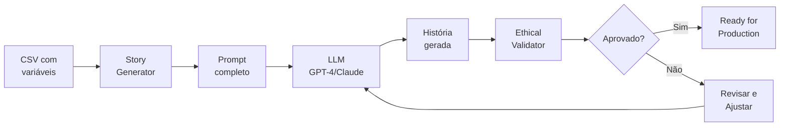

# Pop Rua 2026 - Guia Rápido

## 🚀 Início Rápido em 3 Passos

### 1️⃣ Listar Histórias Disponíveis

```bash
python3 scripts/story_generator.py list
```

Isso mostrará todas as 10 histórias pré-configuradas no CSV.

---

### 2️⃣ Gerar Prompt para uma História

```bash
python3 scripts/story_generator.py generate 002
```

Isso cria o arquivo `output/prompt_historia_002.txt` com o prompt completo.

**O que fazer com o prompt gerado:**
1. Abra o arquivo `prompt_historia_002.txt`
2. Copie todo o conteúdo
3. Cole em uma dessas ferramentas:
   - GPT-4 (ChatGPT)
   - Claude (Anthropic)
   - Gemini
   - Qualquer LLM compatível

---

### 3️⃣ Validar a História Gerada

Depois que a IA gerar a história, salve como `.md` em `/output` e valide:

```bash
python3 scripts/ethical_validator.py
```

Isso verifica:
- ✅ Densidade de caracteres (1100-1300)
- ✅ Ausência de termos vitimizadores
- ✅ Estrutura Viral ST completa
- ✅ Presença de informação de contato
- ✅ Legibilidade adequada

**Score mínimo para aprovação: 70/100**

---

## 📊 Exemplo de Output do Validador

```
📄 exemplo_terminal_onibus.md
   ✅ APROVADO | Score: 86/100
   Issues:
     • Texto muito longo: 1313 chars (máximo: 1300)
   Recomendações:
     → Condensar sem perder profundidade emocional
   Métricas: {
     "char_count": 1313,
     "victimization_terms": 0,
     "dignity_terms": 1,
     "viral_st_score": 6,
     "has_contact_info": true,
     "has_address": true,
     "readability_score": 27.04
   }
```

---

## 🔧 Comandos Úteis

### Ver estrutura do projeto
```bash
ls -lR
```

### Contar histórias no CSV
```bash
wc -l data/historias_base.csv
```

### Ver exemplo completo
```bash
cat output/exemplo_terminal_onibus.md
```

### Adicionar nova história ao CSV
```bash
echo "011,Novo Local,Nome,Conflito,Dica de capacitação,Tema" >> data/historias_base.csv
```

---

## 📝 Template para Adicionar Histórias ao CSV

```csv
ID,LOCAL_COMUM,NOME_FICTICIO,CONFLITO_PRINCIPAL,DICA_CAPACITACAO,tema_narrativo
011,Seu Local Aqui,Nome Fictício,Descrição do Conflito Sistêmico,Endereço ou Tel do Serviço,Tema Geral
```

**Exemplos de locais comuns:**
- Estação de trem às 7h
- Feira livre no sábado
- Biblioteca pública
- Posto de saúde
- Agência de emprego
- Supermercado 24h
- Lavanderia pública

**Temas sistêmicos já cobertos:**
1. Burocracia Excludente
2. Exclusão Financeira
3. Vulnerabilidade Material
4. Invisibilidade Social
5. Saúde Negligenciada
6. Exclusão Digital
7. Violência Institucional
8. Fragmentação Familiar
9. Saúde Mental
10. Discriminação Trabalhista

---

## 🎯 Workflow Completo



---

## ⚡ Próximas Melhorias (Fase 2)

- [ ] Integração direta com API do GPT-4 (automação completa)
- [ ] API ElevenLabs para narração automática
- [ ] Geração visual com Midjourney/Mootion
- [ ] Montagem de vídeo automatizada com FFmpeg
- [ ] Sistema de publicação multi-plataforma

---

## 🆘 Troubleshooting

### Erro: "Master prompt não encontrado"
```bash
# Verifique se o arquivo existe
ls -l prompts/master_prompt_storytelling.txt
```

### Erro: "CSV não encontrado"
```bash
# Verifique se o arquivo existe
ls -l data/historias_base.csv
```

### Validação falha por termos vitimizadores
Revise o texto gerado e remova termos como:
- "coitado"
- "mendigo"
- "vagabundo"
- "sujo"

Use sempre linguagem de dignidade:
- "pessoa em situação de rua"
- "direito à moradia"
- "exclusão sistêmica"

---

## 📚 Documentação Completa

- [README.md](README.md) - Visão geral do projeto
- [Implementation Plan](../brain/e5fce6b5-fbaf-4adc-9489-ea824e1de64d/implementation_plan.md) - Plano técnico detalhado
- [Master Prompt](prompts/master_prompt_storytelling.txt) - Cérebro do sistema

---

**Dúvidas?** Abra uma issue ou consulte a documentação completa.
